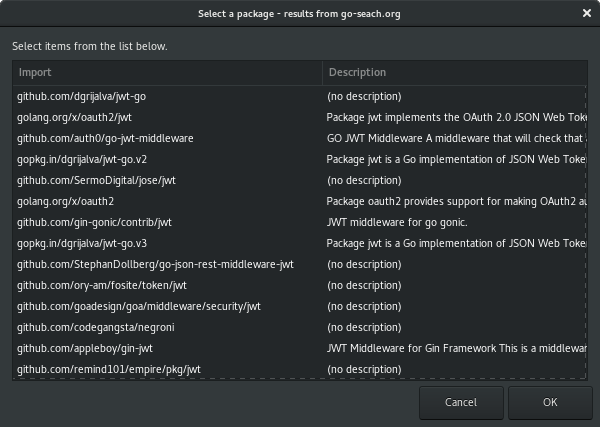

# What can GoSwitch do ?

GoSwitch is a bash script that can install and switch golang version. It has got others options:

- it can install recommended packages as glide, gocode, glide, and so on
- it is able to create [local project](#virtual-environment-like-python) using a specific golang version (as Python VirtualEnv)
- you can check golang versions that are available
- [search and make proposition to install packages](#search-and-install-packages) based on keywords (thanks to [Go-Search](http://go-search.org))

Also, goswitch can do:

- bash completion
- autoupdate itself


## Installation

```
# If ~/.local/bin is in your PATH (recommended)
curl -sSL $(curl -s https://api.github.com/repos/metal3d/goswitch/releases/latest | \
    grep tarball | cut -d '"' -f 4) | \
    tar -zxf - --strip-components=1 -C ~/.local/bin */goswitch

chmod +x ~/.local/bin/goswitch

# OR
sudo curl -sSL $(curl -s https://api.github.com/repos/metal3d/goswitch/releases/latest | \
    grep tarball | cut -d '"' -f 4) | \
    tar -zxf - --strip-components=1 -C ~/usr/local/bin */goswitch

sudo chmod +x /usr/local/bin/goswitch
```

## Usage

```
goswitch command <version>

You can override some configuration by setting values in /home/pafer/.config/goswitch/config.cfg file,
or using environment variables:
    GS_ROOT:   directory where go will be installed
    GS_DIALOG: force dialog to be one of zenity, whiptail or dialog
Example:
    GS_ROOT=/tmp/gopath GS_DIALOG=whiptail goswitch install latest

Commands:
   list:                           list installed version from ~/.go directory

   available:                      list installable go version from golang.org

   install <version>:              install go-<version> (version should be x.y.z,
                                   eg. goswitch install 1.9.1)

   install-package <keyword>:      Search package by keyword on go-search.org, then display a list to 
                                   let you select which one to install.

   use <version>:                  to be call with "eval $(goswitch use <version>)"
                                   to set env vars on current shell

   use <version> default:          set ~/.profile to use that version in next login session
                                   or if you source ~/.profile script

   local-project [dir] [version]:  use [dir] or current directory if [dir] is not
                                   provided to create a local projecct. That creates
                                   a bin/activate to use with 'source' command
                                   eg. goswitch local-project /tmp/myproject
                                   If [version] is not set, the current go version will be used

   bash-completion:                set bash completion, please do 'source <(goswitch bash-completion)'
                                   You may add this line in you ~/.bashrc

   install-recommended <name|all>: install recommended tool "name" to work with Go,
                                   giving "all" will install the entire recommended list,
                                   see "list-recommended" command

   list-recommended:               list recommended gopackage to install

   check-update:                   check latest version of goswitch, doesn't install

   update:                         update goswitch to the latest version

   -h|--help:                      print this help

   -v|--version|-version:          print version
```


To setup a go version, eg. 1.9.1:

```
goswitch install 1.9.1
```

To use that version in current shell

```
eval $(goswitch use 1.9.1)
# or
source <(goswitch use 1.9.1)
```

Note that if you pass from a version to another, the binaries and packages you were using with the last used version will not be available in the new environment. Even if that can be nice to do that, the functionnality could be very complicated to do, and it can create some bad behaviors. So, please, reinstall packages and binaries for that version.

**Do not try to copy pkg or bin directory from version to version, it is not safe and will slow down compilation, use "go get" command instead**

To use that version by default, following command will set variables in ~/.profile:

```
goswitch use 1.9.1 default
```

## Search and install packages

Using [Go-Search API](http://go-search.org), goswitch can make search query and propose to install packages. You must have `jq` command installed.

GoSwitch will try to use "zenity" (if you're in a graphical environment), either it will use whiptail or dialog command. Exemple using `goswitch install-package jwt`




## Configuration

At this time, you can override configuration by using your `$HOME/.config/goswitch/config.cfg`, Uncommand line that you want to change and setup values:

```
# Where golang will be installed
#root = $HOME/.go

# Prefered dialog, goswitch detect if a X session is active
# and tries to use zenity. If you want to always use dialog, whiptail
# or xdialog, set it here
#prefered_dialog = dialog
```

You can also set environment values:

- `GS_ROOT` is the root path where golang will be installed
- `GS_DIALOG` can override the dialog, you can use "zenity", "whiptail", or "dialog"

Note that variables can be passed as command prefix instead of use "export":

```
GS_ROOT=/tmp/gopath goswitch install latest
```


## Virtual environment like Python

You can ask goswitch to provide a local environment to create some project outside GOPATH.

It's very simple:

```bash
goswitch local-project ~/Projects/myproject
```

That creates three directories:

- `~/Projects/myproject/bin` where `activate` scripts is installed. Also, `go get` command will install binaries here.
- `~/Projects/myproject/pkg` where local package are compiled
- `~/Projects/myproject/src` where you should create you subdirectory to work on. Also, `go get` command will install sources here


To activate that environment, use:

```bash
source ~/Projects/myproject/bin/activate
```

That will set GOPATH and PATH environment to use the project environment by default. But your default GOPATH is also inserted to be able to use global packages that you already have installed.

To deactivate, the activation script has created a "deactivate" function that you can call as a command:

```bash
deactivate
```

The last GOPATH and PATH are now set up to the default.

**NOTE**: If the path is not provided, so goswitch will create directories and scripts in the current directory.


You can also set a go version for a project (either it will use the current go version):

```
goswitch local-project ~/Projects/myproject 1.9.1
```

It will set the go version to 1.9.1 as soon as you "activate" the project. The deactivation command will reset you version to the last used (the version you were using before activating the project environemnt).


## Recommended packages

Using vim-go, I was very glade to have a "GoInstallBinaries" command inside Vim to install recommended packages to work.

I also needed [Glide](https://github.com/Masterminds/glide) to manage vendors packages, and [Delve](https://github.com/derekparker/delve) debugger. As I was always searching in Github where are that packages, I added that packages in my list. So you can install my recommended package via goswitch command:

```bash
# install all recommended packages
goswitch install-recommended all

# install one package, for example "glide"
goswitch install-recommended glide
```

TODO: currently, I cannot ask installation of several packages at once, excepting using "all" keyword

NOTE: completion is working for package names.

## Completion

goswitch can provide bash completion, to test, you may try that command in bash session:

```bash
source <(goswitch bash-completion)
```

Then, type "goswitch" and hit `TAB` key on keyboard, completion can also propose installed versions for "use" command, or available versions for "install" command.

If that works for you, add the source command into you `~/.bashrc` file to have it for next shell session.


# Update goswitch

Goswitch checks every 24h if you're using the latest version. It can warn if a latest version is available.

You can force the update check by using:

```
goswitch check-update
```

If you want to update goswitch, try this command:

```
goswitch update
```

If a new version is available, that command will try to install the script at the same place.

Note that to check if you've already checked version, GoSwitch writes a file in `.config/goswitch/` directory.

# What about GVM ?

Why to not use [gvm](https://github.com/moovweb/gvm) ? No reason, I only wanted to make my own in shell script.

GoSwitch script is just a bit less heavy (it's a bash script). GVM is a great project that you should use if goswitch doesn't answer to your needs.
